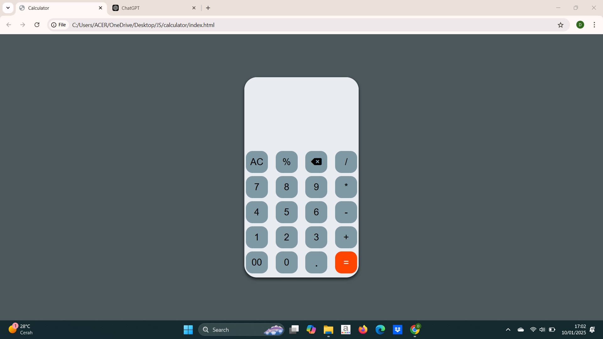

# Calculator
This project is a simple and visually appealing calculator built using HTML, CSS, and JavaScript. The calculator features a clean, modern design and supports basic arithmetic operations.

## Features
- **Basic Arithmetic Operations :** Addition, subtraction, multiplication, division, and percentage.
- **Modern Design :** A sleek and user-friendly interface with rounded edges and a well-organized layout.
- **Responsive Design :** Adapts to various screen sizes to provide a consistent experience.

## Technologies Used

- **HTML :** Provides the structure of the application.
- **CSS :** Handles the styling, including the modern rounded design.
- **JavaScript :** Implements the functionality and logic of the calculator.

## Installation

1. Clone the repository or download the project files.

   ```bash
   git clone https://github.com/Drushti008/Calculator.git

2. Open the index.html file in any modern web browser.

  
## Screenshots
### Calculator Interface



  
 
  
